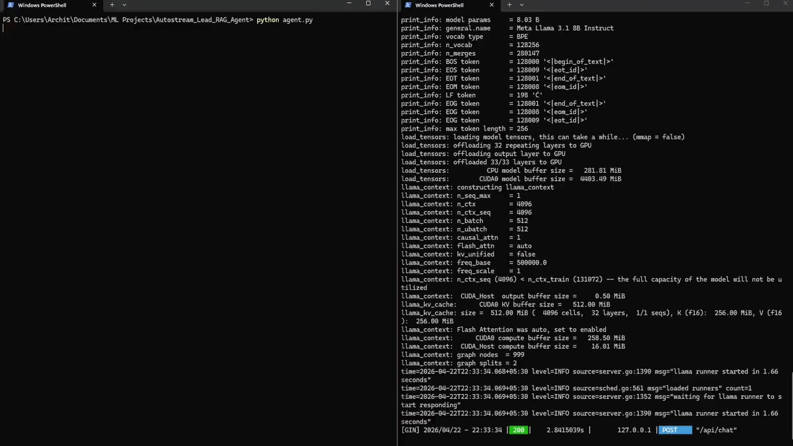

# AutoStream AI Agent 
### Social-to-Lead Agentic Workflow | ServiceHive ML Intern Assignment

A conversational AI agent for **AutoStream** — a fictional SaaS platform for automated video editing. The agent handles product queries using RAG, detects high-intent users, and captures leads via a mock tool — all powered by **Llama 3.1 (local)** and **LangGraph**.

---
## Demo


---

## 🚀 How to Run Locally

### Prerequisites
- Python 3.9+
- [Ollama](https://ollama.com) installed and running
- Llama 3.1 pulled locally

### Step 1 — Install Ollama & pull the model
```bash
# Install Ollama from https://ollama.com/download
# Then pull the model:
ollama pull llama3.1
```

### Step 2 — Clone & install dependencies
```bash
git clone <your-repo-url>
cd autostream-agent

pip install -r requirements.txt
```

### Step 3 — Run the agent
```bash
python agent.py
```

### Step 4 — Chat!
```
You: Hi, what plans do you offer?
Agent: Hey! AutoStream has two plans...

You: I want to try the Pro plan for my YouTube channel
Agent: That's awesome! I'd love to get you set up. What's your name?
```

---

## Architecture

The agent is built using **LangGraph**, a stateful graph execution framework from LangChain. LangGraph was chosen over AutoGen because it provides explicit, auditable state transitions — each node in the graph has a single responsibility, making the pipeline easy to debug and extend.

**Graph structure:**

```
User Input → [intent_node] → [lead_extraction_node] → [chat_node] → Response
```

1. **`intent_node`** — Classifies the user's latest message into `casual`, `inquiry`, or `high_intent` using keyword matching. Once `high_intent` is reached, it's sticky — it won't downgrade mid-conversation.

2. **`lead_extraction_node`** — When `collecting_lead` is `True`, this node parses the user's reply to fill in `lead_name`, `lead_email`, and `lead_platform` sequentially. Fields are extracted one at a time, mirroring how a human salesperson would converse.

3. **`chat_node`** — Calls Ollama (Llama 3.1) with the full message history + a system prompt that embeds the entire knowledge base (RAG via prompt injection). When all three lead fields are present, the LLM appends a hidden `LEAD_READY` signal, triggering `mock_lead_capture()`.

**State management** uses LangGraph's `TypedDict`-based `AgentState`, which retains full conversation history across all turns via the `add_messages` reducer — giving the agent memory across 5–6+ turns naturally.

---

## WhatsApp Deployment via Webhooks

To deploy this agent on WhatsApp, you would use the **WhatsApp Business Cloud API** (Meta) with a webhook-based architecture:

### Architecture

```
WhatsApp User
     │
     ▼
Meta WhatsApp Cloud API
     │  (POST webhook on new message)
     ▼
Your Webhook Server  (FastAPI / Flask)
     │
     ├─ Validate Meta webhook signature (X-Hub-Signature-256)
     ├─ Extract sender phone number + message text
     │
     ▼
AutoStream Agent (agent.py)
     │
     ├─ Look up or create AgentState for this phone number (Redis / DB)
     ├─ Run LangGraph graph with user message
     ├─ Get AI response
     │
     ▼
Meta Send Message API  →  WhatsApp User
```

### Key Steps

1. **Register a webhook** on Meta's Developer Portal pointing to `https://yourdomain.com/webhook`
2. **Verify the webhook** by responding to Meta's `GET` challenge request
3. **Handle `POST` events** — each incoming message triggers a POST with sender info + message body
4. **Session state** — store each user's `AgentState` in **Redis** keyed by phone number, so conversations persist across messages
5. **Send replies** using `requests.post()` to Meta's `v18.0/{phone_id}/messages` endpoint with your access token

### Example FastAPI Webhook (sketch)
```python
from fastapi import FastAPI, Request
import redis, json
from agent import build_graph, AgentState
from langchain_core.messages import HumanMessage, AIMessage

app = FastAPI()
r = redis.Redis()
graph = build_graph()

@app.post("/webhook")
async def webhook(req: Request):
    data = await req.json()
    phone = data["entry"][0]["changes"][0]["value"]["messages"][0]["from"]
    text  = data["entry"][0]["changes"][0]["value"]["messages"][0]["text"]["body"]

    # Load or init state
    raw = r.get(f"state:{phone}")
    state = json.loads(raw) if raw else AgentState(messages=[], intent="casual", ...)

    state["messages"].append(HumanMessage(content=text))
    state = graph.invoke(state)

    # Save updated state
    r.set(f"state:{phone}", json.dumps(state))  # serialize properly

    # Send reply back via Meta API
    reply = next(m.content for m in reversed(state["messages"]) if isinstance(m, AIMessage))
    send_whatsapp_message(phone, reply)
    return {"status": "ok"}
```

---

## Project Structure

```
autostream-agent/
├── agent.py              # Main agent: LangGraph graph, nodes, state, LLM
├── knowledge_base.json   # RAG knowledge base (pricing, policies, FAQs)
├── requirements.txt      # Python dependencies
└── README.md             # This file
```

---

## Intent Detection Logic

| Intent | Triggers |
|--------|----------|
| `casual` | Greetings, small talk |
| `inquiry` | Questions about price, features, refund, support |
| `high_intent` | "sign up", "I want to try", "get started", "I'm ready", etc. |

Intent is **sticky** — once `high_intent` is detected it doesn't revert, so lead collection continues uninterrupted even if the user asks a follow-up question mid-flow.

---

## Switching to Claude 3 Haiku (Optional)

If Llama 3.1 results are unsatisfactory, swap the LLM in `agent.py`:

```python
# In agent.py, replace:
from langchain_ollama import ChatOllama
llm = ChatOllama(model="llama3.1", temperature=0.3)

# With:
from langchain_anthropic import ChatAnthropic
llm = ChatAnthropic(model="claude-haiku-4-5-20251001", temperature=0.3)
```

And add to requirements:
```
langchain-anthropic>=0.3.0
```

Set your API key:
```bash
export ANTHROPIC_API_KEY=your_key_here
```

---

*Built for the ServiceHive ML Intern Assignment — Social-to-Lead Agentic Workflow*
